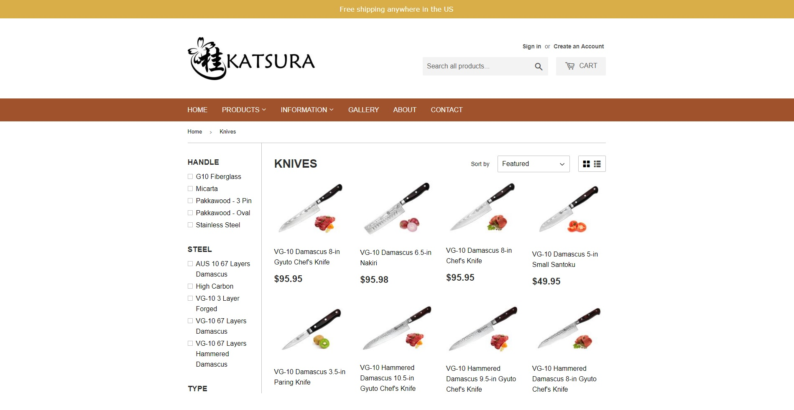
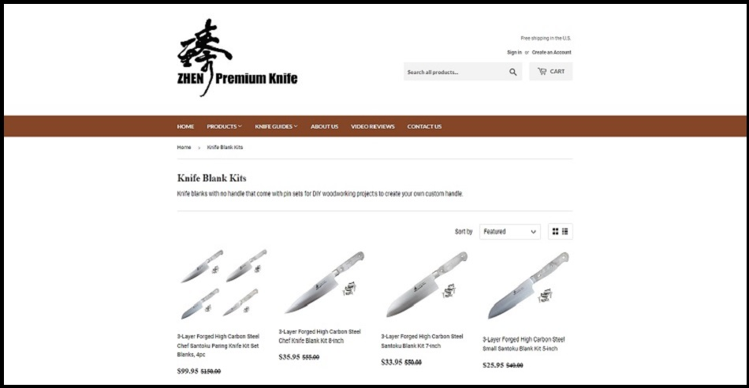

<html>
	<head>
		
   		 <meta name="google-site-verification" content="{{ site.google_verify }}">
		
    		
    		
	</head>
	<body>
		<h2>What you get</h2>
		

		<ul>
			<li>Shopify store website</li>
			<li>Marketing content and product listings</li>
			<li>SEO to get your website at the top of Google search results</li>
			<li>Setup for domain name and host to go live</li>
			<li>Training on how to use your website and how to track performance</li>
		</ul>

		<h2>Featured Work</h2>
		
KATSURA Cutlery

		

		
ZHEN Premium Knife

		

		<h2>Contact</h2>
		
Tell me more about your business for a price quote.  Hablo Español.

		
<form method="POST" action="https://formspree.io/edwincheng097@gmail.com">
		<input type="text" name="name" placeholder="Name" style="height:23px; width:450px" maxlength="50">  	
    		<input type="email" name="email" placeholder="E-mail" style="height:23px; width:450px" maxlength="50">  
    		<textarea name="message" placeholder="Comments" style="height:130px; width:450px" maxlength="800"></textarea>  
		<input type="hidden" name="_subject" value="wincheng.github.io" />
		<input type="text" name="_gotcha" style="display:none" />
		<button type="submit">Send</button>
		</form>

	</body>
	</html>
